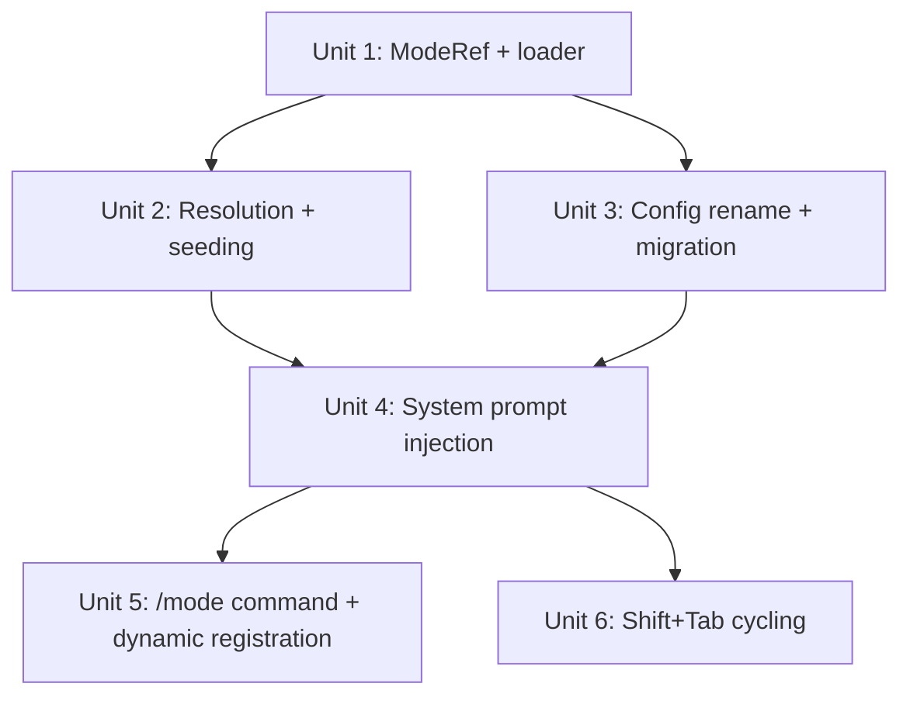

# feat: Modes as a first-class resource type

## Overview

Convert modes from a hardcoded if-statement with a bundled asset file into a first-class resource type — markdown files with YAML frontmatter, 3-tier resolution, seeding, dynamic command registration, and Shift+Tab cycling. Rename the default mode from "ask" to "act".

## Problem Frame

Modes are persistent behavioral modifiers that change the system prompt. Currently they're hardcoded to two values (`ask`/`plan`) with a static asset file. The default name "ask" collides with `permission_mode: ask`. The plan mode prompt blocks all tool use including read-only research. There's no way to add custom modes without modifying source code. (see origin: docs/brainstorms/2026-04-25-modes-resource-type-requirements.md)

## Requirements Trace

- R1. Modes are markdown files with YAML frontmatter in `modes/` directories
- R2. 3-tier resolution with shadow merge (project > global > internal), same as skills
- R3. ModeRef dataclass: `name`, `body`, `source_path`
- R4. Active mode's body appended to system prompt each turn
- R5. `act` is the default mode — empty body, no prompt injection
- R6. Modes seeded to `~/.tigger/modes/` on first launch
- R7. `act.md` — default mode, empty body, all tools
- R8. `plan.md` — allows read-only tools, blocks writes until plan approved
- R9. `/mode` with no args shows current mode and lists available modes
- R10. `/mode <name>` switches to a mode by name
- R11. `/act` and `/plan` are shortcut commands (dynamic, not hardcoded)
- R12. Mode names become commands dynamically — each loaded mode registers `/<name>`
- R13. Shift+Tab cycles through available modes
- R14. Config default changes from `"ask"` to `"act"`
- R15. CLI `--mode` choices updated
- R16. Backward compat: `mode: ask` in config silently maps to `act`
- R17. Toolbar continues to show `mode:X` with new mode names

## Scope Boundaries

- Tool restrictions are prompt-based only, not enforced by the permission system (see origin: docs/brainstorms/2026-04-25-modes-resource-type-requirements.md, Scope Boundaries)
- No mode stacking — only one mode active at a time
- No mode-specific hooks
- No `allow_tools` field on ModeRef in this iteration — tool restrictions are prompt-based. Adding `allow_tools` with enforcement is trivial future work when needed

## Context & Research

### Relevant Code and Patterns

- **Resource type pattern**: `SkillDef` / `AgentDef` / `HookDef` dataclasses in `skills.py` / `hooks.py` with YAML frontmatter parsed by `_parse_single()`
- **Agent loader**: `load_agents_dir()` in `skills.py:192-214` — flat `.md` files, each parsed with `_parse_single()`, name defaults to `entry.stem`. Modes should follow this pattern exactly
- **Shadow merge resolution**: `resolve_skills()` in `resolve.py:131-151` — dict keyed by name, internal first, then global, then project; later entries overwrite. Modes use this strategy
- **Seeding**: `seed_global()` in `resolve.py:23-89` — agents block (lines 60-79) copies flat `.md` files with underscore-prefix dedup. Modes need an identical block
- **Config migration**: `_PERM_RENAME` in `config.py:9` maps old permission names to new ones with a deprecation warning. `ask` → `act` follows this pattern but silently (per R16)
- **Command registration**: `load_builtin_commands()` in `commands/__init__.py:49-77` returns a static dict. Dynamic mode commands will be injected here
- **System prompt injection**: `loop.py:56-58` — hardcoded `if ctx.config.mode == "plan"` appends cached asset text. Replaced by looking up active mode body from resolved modes list
- **Plan mode asset**: `assets/plan_mode.md` — 10 lines, blocks all tool use. Content migrates to `internal/modes/plan.md` with improved prompt allowing read-only tools

### Institutional Learnings

- Architecture-first, content-later: ship the structural skeleton with minimal content, iterate on mode prompts separately
- The `/init` command still scaffolds a deprecated `hooks.py` template — replacing it with a declarative hook template belongs in the hooks refactor plan, not this one. This plan adds `modes/` scaffolding only

## Key Technical Decisions

- **ModeRef dataclass in `skills.py`**: Modes are simple enough to live alongside `SkillDef`/`AgentDef` in the existing module rather than creating a new `modes.py`. The loader and parser infrastructure is already there. A new file would add indirection without value
- **`load_modes_dir()` follows `load_agents_dir()` pattern**: Flat `.md` files in `modes/` directory, each parsed with `_parse_single()`, name defaults to file stem. No need for the directory-per-mode pattern that skills use (modes have no references or assets)
- **Dynamic command collision**: Built-in commands take priority over dynamic mode commands. If a mode name collides with an existing command (e.g., `clear`), the mode is still loaded and accessible via `/mode <name>` and Shift+Tab, but the dynamic `/<name>` shortcut is not registered. A warning is printed at startup. Rationale: built-in commands are more important than convenience shortcuts
- **Modes passed to `loop.run()` via `RunContext`**: Rather than passing modes as a parameter to `run()`, store the resolved modes list on `RunContext` so `loop.py` can look up the active mode's body. This avoids changing `run()`'s signature and keeps mode access consistent
- **`act.md` body is empty string, not None**: An empty body means no system prompt injection. The check in `loop.py` becomes `if mode_body:` — simple truthy check. No special-casing for the default mode
- **Config validation deferred to startup**: `_VALID_MODES` in `config.py` becomes dynamic — validated against resolved mode names. During `load_config()`, accept any string for `mode` field; validate after modes are resolved in `startup()`. This avoids a circular dependency (config loaded before modes are resolved)

## Open Questions

### Resolved During Planning

- **Tool restriction approach** (from origin doc): Prompt-based only. The scope boundary explicitly defers enforcement to future work. `allow_tools` is not included on ModeRef in this iteration — adding it when enforcement is built avoids a decorative field that signals enforcement to future developers when none exists
- **Dynamic command collision priority** (from origin doc): Built-in commands win. Mode shortcuts are convenience; the mode remains accessible via `/mode <name>`. Warning printed at startup for collisions
- **Shift+Tab conflict** (from origin doc): No conflict. Only `tab` is bound in the existing keybindings. `prompt_toolkit` does not bind `s-tab` by default

### Deferred to Implementation

- Exact wording of the improved plan mode prompt (R8) — the current `plan_mode.md` is too restrictive. The new prompt should allow read/glob/grep but block write/edit/bash. Content can be iterated after the structural work ships
- Whether `TiggerCompleter` needs updating for dynamic mode commands — likely yes (mode names should appear in tab completion), but the exact integration depends on how the completer receives the modes list. Note: since dynamic mode commands are injected into the `commands` dict, they may automatically appear in completion via `TiggerCompleter(commands, skills)` without additional work
- `run_forked()` in `loop.py` constructs a new `RunContext` with explicit kwargs. When `modes` is added to `RunContext`, forked contexts will get `modes=[]` (default). This means mode injection is a no-op in forked contexts — intentional, since forked contexts use skill/agent system prompts

## Implementation Units

- [x] **Unit 1: ModeRef dataclass and loader**

**Goal:** Define the ModeRef dataclass and `load_modes_dir()` function so modes can be parsed from markdown files.

**Requirements:** R1, R3

**Dependencies:** None

**Files:**
- Modify: `src/tigger/skills.py` — add `ModeRef` dataclass and `load_modes_dir()` function
- Create: `src/tigger/internal/modes/act.md` — default mode (empty body)
- Create: `src/tigger/internal/modes/plan.md` — plan mode (migrated + improved prompt from `assets/plan_mode.md`)
- Test: `tests/test_modes.py`

**Approach:**
- `ModeRef` dataclass with fields: `name: str`, `body: str`, `source_path: pathlib.Path | None = None`
- `load_modes_dir()` follows `load_agents_dir()` pattern: iterate `.md` files, parse with `_parse_single()`, construct `ModeRef`. Name defaults to file stem
- `act.md` frontmatter: `name: act`, empty body after the closing `---`
- `plan.md` frontmatter: `name: plan`, body contains improved plan mode prompt that allows read-only tools (tool restriction is prompt-based, not enforced via metadata)

**Patterns to follow:**
- `AgentDef` dataclass definition at `skills.py:43-49`
- `load_agents_dir()` at `skills.py:192-214`

**Test scenarios:**
- Happy path: `load_modes_dir()` loads `.md` files from a directory and returns `ModeRef` objects with correct name and body
- Happy path: mode with no explicit `name` in frontmatter defaults to file stem
- Edge case: non-`.md` files in the directory are ignored
- Edge case: directory that doesn't exist returns empty list
- Edge case: `.md` file with invalid/missing frontmatter is skipped
- Edge case: body with `---` lines (e.g., markdown horizontal rules) is preserved correctly by `_parse_single()`

**Verification:**
- `ModeRef` can be constructed from the two internal mode files
- `load_modes_dir()` correctly parses both `act.md` and `plan.md` from `internal/modes/`

---

- [x] **Unit 2: Resolution and seeding**

**Goal:** Wire modes into the 3-tier resolution system and seed internal modes to `~/.tigger/modes/` on first launch.

**Requirements:** R2, R6

**Dependencies:** Unit 1

**Files:**
- Modify: `src/tigger/resolve.py` — add `resolve_modes()` function and modes seeding block in `seed_global()`
- Modify: `src/tigger/main.py` — call `resolve_modes()` at startup, store on `RunContext`
- Modify: `src/tigger/types.py` — add `modes` field to `RunContext`
- Test: `tests/test_resolve.py` — add mode resolution tests
- Test: `tests/test_init_cmd.py` — add mode seeding tests

**Approach:**
- `resolve_modes()` follows `resolve_skills()` pattern exactly: shadow merge by name, internal → global → project order
- `seed_global()` gets a new block for `internal/modes/*.md` following the agents seeding block (lines 60-79) with identical underscore-prefix dedup logic
- `RunContext` gains a `modes: list[ModeRef]` field (default empty list) so loop.py and commands can access resolved modes
- `startup()` in `main.py` calls `resolve_modes()` after the existing skills/agents resolution (around line 113-114)

**Patterns to follow:**
- `resolve_skills()` at `resolve.py:131-151`
- Agents seeding block at `resolve.py:60-79`
- Skills/agents resolution call at `main.py:113-114`

**Test scenarios:**
- Happy path: `resolve_modes()` merges modes across 3 tiers with project shadowing global shadowing internal
- Happy path: `seed_global()` copies internal mode files to `~/.tigger/modes/`
- Edge case: `seed_global()` skips modes that already exist in `~/.tigger/modes/`
- Edge case: underscore-prefixed mode `_act.md` skipped if `act.md` already exists
- Edge case: `force=True` overwrites existing mode files
- Happy path: modes are available on `RunContext.modes` after startup

**Verification:**
- Resolution produces correct mode list from a 3-tier directory structure
- Seeding creates `~/.tigger/modes/` with `act.md` and `plan.md`
- `RunContext.modes` is populated after startup

---

- [x] **Unit 3: Config rename (ask → act) and migration**

**Goal:** Rename the default mode from "ask" to "act" with silent backward compatibility.

**Requirements:** R5, R14, R15, R16

**Dependencies:** Unit 1 (can run in parallel with Unit 2)

**Files:**
- Modify: `src/tigger/config.py` — add `_MODE_RENAME`, update `_VALID_MODES`, change default mode handling
- Modify: `src/tigger/types.py` — change `Config.mode` default from `"ask"` to `"act"`
- Modify: `src/tigger/main.py` — update `--mode` CLI choices, defer mode validation to after resolution
- Test: `tests/test_config.py` (or existing config tests)

**Approach:**
- Add `_MODE_RENAME = {"ask": "act"}` in `config.py`, apply silently (no warning, unlike `_PERM_RENAME`)
- Remove `_VALID_MODES` static set — mode validation moves to `startup()` after modes are resolved. `load_config()` accepts any string for `mode` and applies the rename mapping
- `Config.mode` default changes from `"ask"` to `"act"`
- CLI `--mode` choices: remove `choices=["ask", "plan"]` constraint from argparse (since modes are now dynamic). Validation happens at startup
- Startup validation: after `resolve_modes()` runs, validate `ctx.config.mode` against resolved mode names. If invalid, print a warning naming the invalid mode and available modes, then reset via `dataclasses.replace(ctx.config, mode="act")`. This follows the RTK auto-detection pattern at `main.py:103-104`
- `write_config()` continues to serialize `mode` as-is — no migration needed on write

**Patterns to follow:**
- `_PERM_RENAME` at `config.py:9` — identical pattern but silent (no `warnings.warn`)

**Test scenarios:**
- Happy path: config with `mode: act` loads correctly
- Happy path: config with `mode: plan` loads correctly
- Happy path: config with no `mode` field defaults to `"act"`
- Integration: config with `mode: ask` silently maps to `"act"`
- Edge case: config with unknown mode name loads without error (validation deferred to startup)
- Happy path: CLI `--mode act` sets mode to act
- Happy path: CLI `--mode plan` sets mode to plan

**Verification:**
- Existing `mode: ask` configs load without error and result in `mode: "act"`
- New default mode is `"act"`
- CLI accepts any mode name

---

- [x] **Unit 4: System prompt injection via resolved modes**

**Goal:** Replace the hardcoded plan mode check in `loop.py` with a generic lookup against the active mode's body from the resolved modes list.

**Requirements:** R4, R7, R8

**Dependencies:** Units 2 and 3

**Files:**
- Modify: `src/tigger/loop.py` — replace `_load_plan_mode_text()` and `if ctx.config.mode == "plan"` with mode body lookup from `ctx.modes`
- Delete: `src/tigger/assets/plan_mode.md` — content migrated to `internal/modes/plan.md` in Unit 1
- Test: `tests/test_loop.py` (or add mode injection tests)

**Approach:**
- Remove `_load_plan_mode_text()` function and its `lru_cache`
- In `run()`, replace lines 56-58 with: look up active mode name from `ctx.config.mode` in `ctx.modes`, append `mode.body` to system prompt if truthy
- Helper: `_active_mode_body(ctx) -> str` that finds the mode matching `ctx.config.mode` and returns its body, or empty string if not found
- The `act` mode has empty body → no injection (truthy check handles this)
- The `plan` mode has non-empty body → injected each turn (same behavior as before, but from resolved mode data)

**Patterns to follow:**
- The existing injection point at `loop.py:56-58`

**Test scenarios:**
- Happy path: when mode is `"plan"`, plan mode body is appended to system prompt
- Happy path: when mode is `"act"`, no text is appended to system prompt
- Happy path: custom mode with body text has that text appended to system prompt
- Edge case: mode name in config doesn't match any resolved mode — no injection, no crash
- Integration: mode body is injected fresh each turn (not cached across turns), so switching modes mid-session takes effect immediately

**Verification:**
- System prompt includes plan mode text when mode is "plan"
- System prompt has no mode injection when mode is "act"
- `assets/plan_mode.md` is deleted
- Switching mode mid-session changes the system prompt on the next turn

---

- [x] **Unit 5: /mode command, dynamic mode commands, and completer**

**Goal:** Update `/mode` to list/switch using resolved modes. Register each mode as a dynamic `/<name>` command. Update tab completion.

**Requirements:** R9, R10, R11, R12, R17

**Dependencies:** Unit 4

**Files:**
- Modify: `src/tigger/commands/misc.py` — rewrite `cmd_mode()` to use resolved modes list
- Modify: `src/tigger/commands/__init__.py` — add `modes` parameter to `load_builtin_commands()`, register dynamic mode commands, generate `COMMAND_DESCRIPTIONS` entries for dynamic modes
- Modify: `src/tigger/main.py` — pass modes to `load_builtin_commands()`, pass mode names to completer
- Modify: `src/tigger/completer.py` — accept mode names for completion
- Modify: `src/tigger/commands/init.py` — add `modes/` to `_DIR_TEMPLATES` with example mode template
- Test: `tests/test_init_cmd.py` — update for new scaffolding

**Approach:**
- `cmd_mode(args, ctx, modes)`: no args → print current mode + list all available modes with names. With args → validate against resolved mode names, switch via `dataclasses.replace(ctx.config, mode=new_mode)`
- `load_builtin_commands()` accepts `modes: list[ModeRef]`. For each mode, check if `mode.name` collides with existing command keys. If no collision, register `mode.name` → `partial(_switch_mode, mode_name=mode.name)` where `_switch_mode(mode_name, args, ctx)` just calls `cmd_mode(mode_name, ctx, modes=modes)`. If collision, print warning to stderr
- `cmd_mode` receives modes via `partial()` binding, same as other commands
- `COMMAND_DESCRIPTIONS["mode"]` updated from `"Switch mode (ask/plan)"` to `"Switch mode (act/plan/...)"`
- `COMMAND_HELP["mode"]` updated to reflect dynamic mode list
- Dynamic mode commands get auto-generated `COMMAND_DESCRIPTIONS` entries: e.g., `"act": "Switch to act mode"`, `"plan": "Switch to plan mode"`. This ensures they appear in `/help` output with clear purpose
- `TiggerCompleter` constructor accepts optional `mode_names: list[str]` parameter, adds them to `_candidates`
- Init scaffolding: add `"modes"` to `_DIR_TEMPLATES` with example mode template

**Patterns to follow:**
- `partial(agent_cmd.cmd_agent, agents=agents, ...)` at `commands/__init__.py:70`
- `TiggerCompleter` constructor at `completer.py:12-25`

**Test scenarios:**
- Happy path: `/mode` with no args prints current mode and lists all available modes
- Happy path: `/mode plan` switches to plan mode
- Happy path: `/mode act` switches to act mode
- Happy path: `/plan` shortcut switches to plan mode
- Happy path: `/act` shortcut switches to act mode
- Edge case: `/mode nonexistent` prints error with available mode names
- Edge case: mode named "clear" does not override built-in `/clear` command; warning printed
- Happy path: mode names appear in tab completion
- Happy path: `/init` scaffolds `modes/` directory with example mode template
- Happy path: dynamic mode commands appear in `/help` with auto-generated descriptions

**Verification:**
- `/mode` lists all resolved modes
- Dynamic mode shortcuts work for all loaded modes
- Tab completion includes mode names
- No command collisions with default `act`/`plan` mode names
- `/init` creates `modes/` directory with template
- `/help` shows dynamic mode commands with descriptions

---

- [x] **Unit 6: Shift+Tab mode cycling**

**Goal:** Add a Shift+Tab keybinding that cycles through available modes.

**Requirements:** R13

**Dependencies:** Unit 4 (can run in parallel with Unit 5 — only needs modes on RunContext, not command registration)

**Files:**
- Modify: `src/tigger/main.py` — add `s-tab` keybinding to `_kb` in `repl()`

**Approach:**
- Add `@_kb.add("s-tab")` handler in `repl()` after the existing `tab` handler (around line 237)
- The handler reads current mode from `ctx.config.mode`, finds its index in an alphabetically sorted mode names list, cycles to the next mode (wrapping around), and updates `ctx.config` via `dataclasses.replace()`. Alphabetical sort is chosen for predictability — users can reason about order without knowing resolution internals. Computed per keypress (not cached)
- Mode names are derived from `ctx.modes` (the resolved modes list on RunContext)
- After switching, briefly indicate the new mode — since this is a keybinding handler, use `event.app.invalidate()` to force toolbar refresh (toolbar already shows `mode:X`)

**Patterns to follow:**
- Existing `@_kb.add("tab")` handler at `main.py:227-237`

**Test scenarios:**
- Happy path: Shift+Tab cycles from `act` → `plan` → `act` (with 2 modes)
- Happy path: Shift+Tab with 3+ modes cycles through all of them in order
- Edge case: Shift+Tab with only 1 mode loaded does nothing (stays on same mode)
- Happy path: toolbar updates immediately after Shift+Tab to show new mode name

**Verification:**
- Pressing Shift+Tab changes the mode and the toolbar reflects the new mode
- Cycling wraps around from last mode back to first

## System-Wide Impact

- **Interaction graph:** `main.py::startup()` → `resolve_modes()` → stores on `RunContext.modes`. `loop.py::run()` reads `ctx.modes` + `ctx.config.mode` for system prompt injection. `commands/misc.py::cmd_mode()` reads/writes `ctx.config.mode` against `ctx.modes`. `commands/__init__.py` generates dynamic command entries from modes list. `completer.py` includes mode names in tab completion. `resolve.py::seed_global()` seeds mode files on first launch
- **Error propagation:** Missing mode files are non-fatal — `load_modes_dir()` returns empty list, `resolve_modes()` returns empty list, mode body lookup returns empty string. Unknown mode name in `/mode` command prints user-facing error
- **State lifecycle risks:** Mode switching mutates `ctx.config` via `dataclasses.replace()`. This is the established pattern for all config mutations. No persistence risk — mode persists in config.json only via `/mode` + explicit save, or via `write_config()` on exit
- **API surface parity:** The `write_config()` function already serializes `mode` — no change needed. The CLI `--mode` flag needs its `choices` constraint removed
- **Unchanged invariants:** `Config` remains a frozen dataclass. `RunContext` mutation patterns unchanged. System prompt construction flow unchanged (just the injection source changes). Toolbar format string unchanged except mode value. Session save/load unaffected

## Risks & Dependencies

| Risk | Mitigation |
|------|------------|
| Dynamic mode commands collide with future built-in commands | Built-in commands always win; mode shortcuts are convenience only. Users can always use `/mode <name>` |
| Mode validation deferred from `load_config()` to `startup()` means invalid mode in config.json doesn't fail early | Acceptable trade-off: validation at startup is early enough. Print clear error if mode doesn't match any resolved mode name, fall back to `"act"` |
| `_parse_single()` in `skills.py` is shared infrastructure — changes could affect skills/agents/hooks | `_parse_single()` is not being modified. `ModeRef` and `load_modes_dir()` are additive |

## Sources & References

- **Origin document:** [docs/brainstorms/2026-04-25-modes-resource-type-requirements.md](docs/brainstorms/2026-04-25-modes-resource-type-requirements.md)
- Related code: `resolve.py` (resolution + seeding), `skills.py` (resource type pattern), `loop.py` (system prompt injection), `commands/misc.py` (mode command), `commands/__init__.py` (command registration), `main.py` (startup + keybindings)
- Related plan: `docs/plans/2026-04-25-001-refactor-unified-declarative-hooks-plan.md` (hooks refactor establishes the declarative resource type pattern this plan follows)
